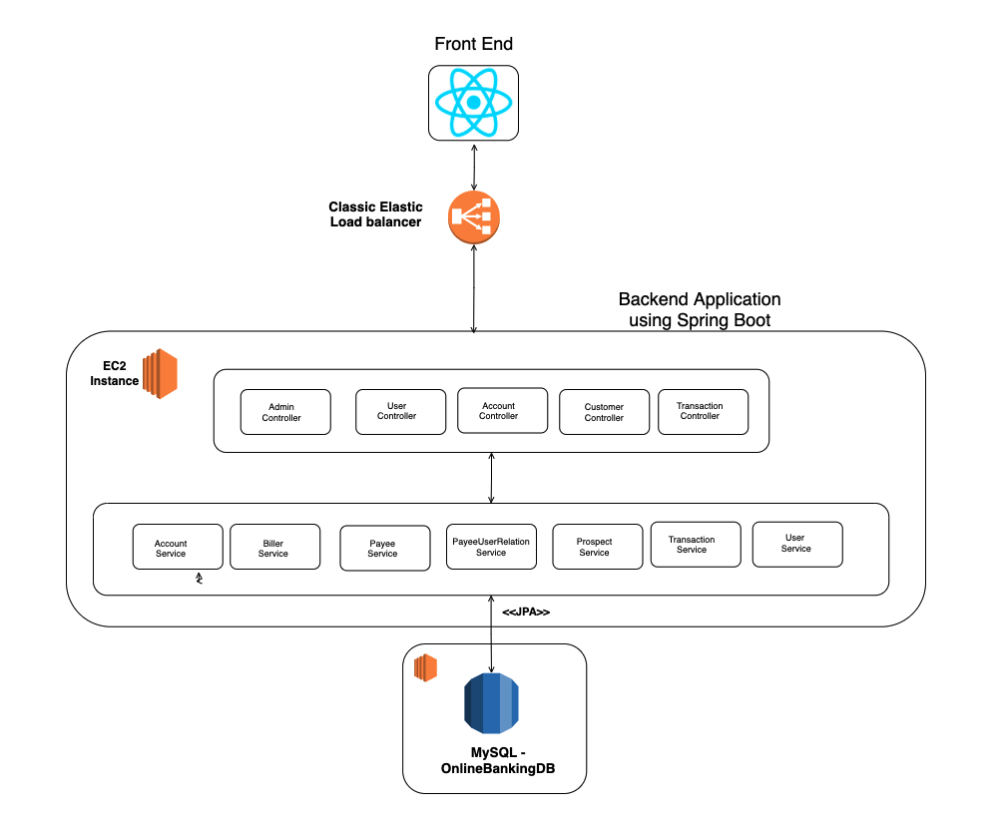

## Online Banking features:

### User:

- Registration for normal user online banking account.

- Each normal user will have 2 accounts, Checking, Savings accounts.

- Transfer (internal) between your own accounts - one time or recurring

- Set up recurring or one-time Bill payment for external payees

- View and search Transactions - for credits/debits/checks/fees - up to last 18 months

### Admin:

- Adding new accounts - Checking, Savings

- Closing existing accounts

- Add transactions - such as manual refunds on fees

## Tools and Languages

- FrontEnd using React

- Backend using Springboot

- Database using Mysql

## Architecture Diagram

## UI Wireframe

## Screenshots

